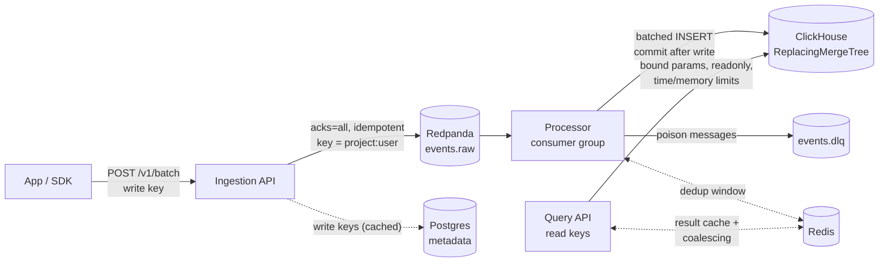

# Event Analytics

[](https://github.com/shivam06062003/event-analytics/actions/workflows/ci.yml)

A real-time product analytics platform, a small Mixpanel or Segment. Apps
send user events. The platform ingests them at high volume through Kafka,
processes them, and answers funnel, retention and segmentation queries from
ClickHouse.

> **Status:** All six phases complete. See [Roadmap](#roadmap), [benchmarks](#benchmarks) and [Kubernetes](#kubernetes).

## Architecture



Dashed components arrive in later phases. Design rationale:
[ADR 0001](docs/adr/0001-architecture-and-ingestion.md) (architecture and ingestion) and
[ADR 0002](docs/adr/0002-stream-processing-and-deduplication.md) (processing and dedup),
[ADR 0003](docs/adr/0003-query-api.md) (query API),
[ADR 0004](docs/adr/0004-identity-sessions-tracking-plans.md) (identity, sessions, tracking plans),
[ADR 0005](docs/adr/0005-operability-and-load-testing.md) (metrics, tracing, quotas, load testing),
[ADR 0006](docs/adr/0006-kubernetes-and-autoscaling.md) (Kubernetes and autoscaling).

## Highlights

### Kubernetes (Phase 6)

- **A Helm chart for the app**: migrations run as a `pre-install/pre-upgrade`
  hook, the API has an HPA and a PodDisruptionBudget, probes split into
  startup/liveness/readiness, and pods run non-root with a read-only root
  filesystem.
- **KEDA autoscales processors on Kafka consumer lag**, not CPU. On a local
  kind cluster, a burst of 129k events (0 failures) took the processors from
  1 to 3 as lag hit 56k, drained it to 0 in about 80 s, then stepped back
  down one replica at a time.
- **Gotchas found and fixed:**
  - Kubernetes service-link env vars (`CLICKHOUSE_PORT=tcp://...`) crashed
    startup
  - KEDA's `cooldownPeriod` doesn't control scale-down (the HPA's 300 s
    window does)
  - the broker's advertised address must be fully qualified for clients in
    other namespaces

### Operability (Phase 5)

- **Prometheus metrics that matter.** Consumer lag per partition,
  **ingest-to-queryable latency**, events by outcome, Kafka ack time, and
  query latency and cache hits. Labels stay low-cardinality (route templates,
  no per-tenant labels). There's a provisioned Grafana dashboard and 6 alert
  rules validated in CI.
- **Tracing across Kafka.** The `traceparent` travels in message headers, and
  the processor's batch span carries **span links** to every request whose
  events it stored. This was verified in Jaeger.
- **Per-project quotas charged per event** (Lua token bucket in Redis), so
  batching can't multiply a tenant's allowance. There's a separate query
  quota, and both fail open with an alert.
- **Load tested with a documented bottleneck hunt.** The limit moved from API
  CPU (fixed with a memoized, Kafka-compatible partitioner), to the load
  generator, to the broker. The best run was **~17.4k events/s sustained, 0
  failures**. Scaling consumers on a single laptop starved the broker, and
  the ADR records that honestly.

### Identity, sessions, tracking plans (Phase 4)

- **Retroactive identity merge.** A ClickHouse materialized view records
  anonymous → user links on insert, and queries resolve each event to a
  person at read time. A funnel from anonymous browsing to a purchase after
  login counts as one conversion. The first link wins, so shared devices
  don't fuse people.
- **Sessionization at query time** with window functions (`lagInFrame`, a
  running `sum`). Late events land in the right session, sessions spanning
  login stay whole, and range edges are handled correctly (tested).
- **Tracking plans.** Versioned per-project event schemas enforced at
  ingestion (warn records violations, block rejects). **Breaking changes are
  refused** unless forced, the same BACKWARD compatibility idea as schema
  registries.
- **Found and fixed:** a ClickHouse alias-shadowing bug in the materialized
  view (fixed with a corrective migration, not by editing an applied one), a
  test that couldn't tell Alice from Bob, and a test-harness consumer that
  died on poison messages.

### Query API (Phase 3)

- **Segmentation, funnels, retention.** Segmentation covers counts or unique
  users by hour/day/week with breakdowns and property filters. Funnels use
  `windowFunnel`, so order matters and a window applies, and conversions may
  finish after the range ends. Retention builds weekly or daily cohorts.
- **Injection-proof.** Every user value, including property names, is a
  server-side bound parameter. Queries also run `readonly=2`, which a query
  can't lift. A test fires `') OR 1=1; DROP TABLE events; --` and the table
  survives.
- **Guard rails.** Range and bucket limits are checked before ClickHouse.
  Per-query time and memory limits are enforced inside it (tested against
  real ClickHouse). Breakdowns show the top 10 plus `$other`.
- **Read keys** are separate from the embeddable write keys, never cached,
  and revoked instantly.
- **Redis cache with recency-based TTL** (30 s for live data, 1 h for
  history). Identical concurrent queries are **coalesced** into one
  ClickHouse execution.
- **Two real bugs caught by tests:** a missing property counted as `0`
  (`value <= 50` matched events with no value), and a shared-result mutation
  that crashed coalesced requests.

### Processing (Phase 2)

- **At-least-once, never lossy.** Offsets are committed only after the
  ClickHouse insert succeeds. A test stops the processor mid-outage and
  checks the committed offsets didn't move. Committing first makes the test
  fail.
- **Two-layer deduplication.** Kafka redeliveries (identical rows) are
  collapsed by `ReplacingMergeTree`. Client retries (same `event_id`, new
  `received_at`, so a different sort key) are caught by a Redis window that
  is marked *after* the insert, so a crash can never drop an event. Removing
  the Redis layer makes the retry test fail.
- **Poison messages don't block partitions.** Unparseable or unknown-version
  messages go to `events.dlq` with the original bytes and their source
  partition and offset.
- **Backpressure without rebalance storms.** While ClickHouse is down, the
  processor pauses its partitions but keeps polling, so it stays in the
  consumer group. Kafka buffers, and it resumes automatically.
- **ClickHouse-friendly writes.** One batched insert per poll, a sort key
  matched to query patterns, monthly partitions, and Kafka lineage columns on
  every row.

### Ingestion (Phase 1)

- **Durable ingestion.** `202 Accepted` is returned only after the broker
  acknowledges the write (`acks=all`, idempotent producer). A test with a
  broker that never acknowledges proves the API returns `503`; changing the
  code to fire-and-forget makes that test fail.
- **Effectively-once by design.** Client-generated `event_id`s stay stable
  across retries. Retries are safe because duplicates are removed downstream.
- **Order where it matters.** The partition key `project:user` keeps each
  user's events in order and spreads large projects across partitions (no hot
  partitions).
- **Clock-skew correction.** Wrong device clocks are fixed using `sent_at`
  vs `received_at`.
- **Partial batch acceptance.** Bad events are rejected individually with
  reasons, and good ones still get in. Unknown fields are rejected, which
  catches SDK typos.
- **Abuse limits.** Body size is checked before reading; events per batch
  and property size are capped.
- **Write keys** are hashed, scoped per project, and cached for the hot path
  (with a documented revocation trade-off).
- **Topics as code** (`ensure-topics`, alongside migrations). CI tests run
  against real Postgres and Redpanda.

## Quick start

Prerequisites: Docker Desktop and Python 3.12+.

```bash
make up                                   # postgres, redpanda, migrations + topics, api on :8001
KEY=$(make -s project name="Demo app")    # create a project; prints its write key
make send key=$KEY                        # {"accepted":2,"rejected":[]}
make events                               # the events, now queryable in ClickHouse
make read-key project=<id>                # a key for the query API (id printed by `make project`)
make seed project=<id>                    # 200k users / ~1.1M realistic events in ~20s
make lag                                  # consumer lag per partition
make console                              # browse topics/messages at http://localhost:8081
```

### Local development

```bash
cp .env.example .env
make install && make infra && make migrate
make check                                # lint + typecheck + tests (same as CI)
```

## Ingestion API

`POST /v1/batch` with `Authorization: Bearer <write key>`:

```json
{
  "sent_at": "2026-09-26T10:00:05Z",
  "batch": [
    {
      "event_id": "5f2c7c1e-3d1a-4c5e-9d8e-1a2b3c4d5e6f",
      "event": "checkout_started",
      "user_id": "u-42",
      "timestamp": "2026-09-26T10:00:00Z",
      "properties": {"plan": "pro", "value": 49},
      "context": {"locale": "en-IN"}
    }
  ]
}
```

| Response | Meaning | What the client should do |
|---|---|---|
| `202` `{"accepted": n, "rejected": [...]}` | Accepted events are durably stored | Drop the rejected ones; don't retry them unchanged |
| `400 no_valid_events` | Every event failed validation | Fix the SDK |
| `401` | Missing or invalid write key | |
| `413` / `411` / `422 batch_too_large` | Over a size limit | Send smaller batches |
| `503 ingest_unavailable` + `Retry-After` | Event log unavailable | **Retry the same batch** (same `event_id`s) |

Rules:

- each event needs `event_id` (a UUID, stable across retries), `event`, and
  either `user_id` or `anonymous_id`
- limits: 1 MB body, 500 events, 32 KB of properties per event

## Query API

All endpoints take `Authorization: Bearer <read key>`. Times are ISO 8601; buckets are UTC.

```bash
# Funnel: signup → checkout → purchase within 2 days
curl -s localhost:8001/v1/query/funnel -H "Authorization: Bearer $READ_KEY" -H 'content-type: application/json' -d '{
  "from": "2026-06-01T00:00:00Z", "to": "2026-07-27T00:00:00Z", "window_seconds": 172800,
  "steps": [{"event": "signup"}, {"event": "checkout_started"},
            {"event": "purchase", "filters": [{"property": "value", "operator": "gte", "value": 100}]}]
}' | jq '.steps'
```

| Endpoint | Answers |
|---|---|
| `POST /v1/query/segmentation` | `event`, `interval` (hour/day/week), `measure` (total/unique_users), `breakdown`, `filters` |
| `POST /v1/query/funnel` | `steps` (each with optional `filters`), `window_seconds` |
| `POST /v1/query/retention` | `start_event`, `return_event` (or any), `period` (day/week), `periods` |
| `POST /v1/query/sessions` | `interval`, `inactivity_minutes`: sessions, users, avg duration, bounce rate, events/session |
| `GET /v1/event-names` | Recent event names by frequency |
| `GET /v1/tracking-plan` · `PUT` (key with `--manage`) | Versioned event schemas; `PUT` refuses breaking changes unless `allow_breaking_changes` |
| `GET /v1/tracking-plan/violations` | Recorded violations by event and reason |

People-based queries (unique users, funnels, retention, sessions) count **persons**: anonymous activity is merged into the user it was later linked to.

Filter operators: `eq`, `neq`, `contains`, `gt`, `gte`, `lt`, `lte`, `is_set`, `is_not_set`.
Every response includes `meta.cached` and `meta.computed_at`.

## Benchmarks

The dataset is 200k users and **1.15M events** over 8 weeks (`make seed`), on an
M1 laptop stack with ClickHouse capped at 1.2 GB:

| Query (8 weeks) | Cold | Cached |
|---|---|---|
| Segmentation: unique users by path, daily | 798 ms | 66 ms |
| Funnel: 3 steps | 366 ms | 46 ms |
| Retention: 8 × 8 weekly cohorts | 1,350 ms | 65 ms |
| Sessions: 953k sessions, weekly | 3,838 ms | ~60 ms |

- The funnel returns 40.1% → 54.95%, matching the generator's 40% and 55%
  probabilities.
- For one project, one week and one event, the sort key reads **18 of 147
  granules**.
- Storage compresses 2.9×.

Details are in [ADR 0003](docs/adr/0003-query-api.md#measured).

### Observability

```bash
make observability       # stack + Prometheus :9091, Grafana :3002, Jaeger :16687 (tracing on)
make loadtest vus=16 batch=500 duration=40s
```

### Ingestion load test (M1 laptop, everything in one Docker VM)

| Setup | Throughput | Errors |
|---|---|---|
| Broker 2 cores / 1 GB, 1 processor, 500-event batches | **~17.4k events/s** sustained | 0 |
| Broker 1 core / 512 MB | ~6.6k events/s (Kafka ack p95 ≥ 1 s) | 0 |
| 3 processors on the same laptop | collapsed (broker starved of CPU) | 16–22% |

Details are in [ADR 0005](docs/adr/0005-operability-and-load-testing.md).

## Kubernetes

```bash
make down          # free memory: the Compose stack and a kind cluster don't both fit in 8 GB
make k8s-up        # kind cluster + metrics-server + KEDA + backing services + Helm install
make k8s-burst     # in-cluster load burst: watch processors scale on lag
make k8s-status    # pods, autoscalers, consumer lag
make k8s-down      # delete the cluster
```

Chart: [`deploy/helm/event-analytics`](deploy/helm/event-analytics). Laptop overrides:
[`deploy/k8s/values-kind.yaml`](deploy/k8s/values-kind.yaml). The backing-service manifests
in `deploy/k8s/infra/` are for local clusters only; in production, use managed services.

## Project layout

```
app/
  api/            Routes, auth (write keys), middleware (request id, size limit), errors
  services/       Ingestion (validation, skew correction, produce), projects/keys
  processor/      Kafka consumer -> ClickHouse: parse, dedup, sink, DLQ, commit
  query/          Safe SQL builders, segmentation/funnel/retention, executor limits, cache
  core/           Config, logging, Postgres, ClickHouse, Kafka, metrics, tracing, quotas
  models/         Postgres metadata tables
  schemas/        Event and batch schemas
migrations/       Alembic (Postgres)
clickhouse/       ClickHouse migrations, demo-data generator, low-memory server config
deploy/           Helm chart, kind config, local backing services, setup script
observability/    Prometheus config + alert rules, Grafana dashboard
loadtest/         k6 ingestion load test
tests/            Against real Postgres, Redpanda, ClickHouse and Redis (isolated per session)
docs/adr/         Architecture Decision Records
```

## Roadmap

- [x] **Phase 1: Ingestion.** Batch API, write keys, durable idempotent producer, partitioning, skew correction, partial acceptance, limits.
- [x] **Phase 2: Processing.** Consumer group writes to ClickHouse, two-layer dedup, dead-letter topic, commit after write, pause-based backpressure, lag.
- [x] **Phase 3: Query API.** Segmentation, funnels, retention, read keys, injection-proof SQL, guard rails, caching with coalescing.
- [x] **Phase 4: Sessions and schemas.** Retroactive identity merge, query-time sessionization, versioned tracking plans with breaking-change protection.
- [x] **Phase 5: Operability.** Metrics, alerts and dashboard; tracing across Kafka; per-event quotas; load test (~17.4k events/s on a laptop, bottlenecks documented).
- [x] **Phase 6: Kubernetes.** Helm chart (hook migrations, HPA, PDB, probes, hardened pods), KEDA autoscaling on consumer lag, verified on kind.
