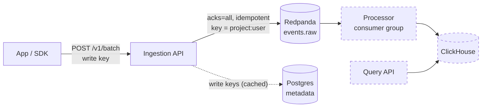

# Event Analytics

[](https://github.com/shivam06062003/event-analytics/actions/workflows/ci.yml)

A real-time product analytics platform, a small Mixpanel or Segment. Apps
send user events. The platform ingests them at high volume through Kafka,
processes them, and answers funnel, retention and segmentation queries from
ClickHouse.

> **Status:** Phase 1 (ingestion) complete. See [Roadmap](#roadmap).

## Architecture



Dashed components arrive in later phases. The design rationale is in
[ADR 0001](docs/adr/0001-architecture-and-ingestion.md).

## Highlights (Phase 1)

- **Durable ingestion.** `202 Accepted` is returned only after the broker
  acknowledges the write (`acks=all`, idempotent producer). A test with a
  broker that never acknowledges proves the API returns `503`; changing the
  code to fire-and-forget makes that test fail.
- **Effectively-once by design.** Client-generated `event_id`s stay stable
  across retries. Retries are safe because duplicates are removed downstream.
- **Order where it matters.** The partition key `project:user` keeps each
  user's events in order and spreads large projects across partitions (no hot
  partitions).
- **Clock-skew correction.** Wrong device clocks are fixed using `sent_at`
  vs `received_at`.
- **Partial batch acceptance.** Bad events are rejected individually with
  reasons, and good ones still get in. Unknown fields are rejected, which
  catches SDK typos.
- **Abuse limits.** Body size is checked before reading; events per batch
  and property size are capped.
- **Write keys** are hashed, scoped per project, and cached for the hot path
  (with a documented revocation trade-off).
- **Topics as code** (`ensure-topics`, alongside migrations). CI tests run
  against real Postgres and Redpanda.

## Quick start

Prerequisites: Docker Desktop and Python 3.12+.

```bash
make up                                   # postgres, redpanda, migrations + topics, api on :8001
KEY=$(make -s project name="Demo app")    # create a project; prints its write key
make send key=$KEY                        # {"accepted":2,"rejected":[]}
make console                              # browse the messages at http://localhost:8081
```

### Local development

```bash
cp .env.example .env
make install && make infra && make migrate
make check                                # lint + typecheck + tests (same as CI)
```

## Ingestion API

`POST /v1/batch` with `Authorization: Bearer <write key>`:

```json
{
  "sent_at": "2026-09-26T10:00:05Z",
  "batch": [
    {
      "event_id": "5f2c7c1e-3d1a-4c5e-9d8e-1a2b3c4d5e6f",
      "event": "checkout_started",
      "user_id": "u-42",
      "timestamp": "2026-09-26T10:00:00Z",
      "properties": {"plan": "pro", "value": 49},
      "context": {"locale": "en-IN"}
    }
  ]
}
```

| Response | Meaning | What the client should do |
|---|---|---|
| `202` `{"accepted": n, "rejected": [...]}` | Accepted events are durably stored | Drop the rejected ones; don't retry them unchanged |
| `400 no_valid_events` | Every event failed validation | Fix the SDK |
| `401` | Missing or invalid write key | |
| `413` / `411` / `422 batch_too_large` | Over a size limit | Send smaller batches |
| `503 ingest_unavailable` + `Retry-After` | Event log unavailable | **Retry the same batch** (same `event_id`s) |

Rules:

- each event needs `event_id` (a UUID, stable across retries), `event`, and
  either `user_id` or `anonymous_id`
- limits: 1 MB body, 500 events, 32 KB of properties per event

## Project layout

```
app/
  api/            Routes, auth (write keys), middleware (request id, size limit), errors
  services/       Ingestion (validation, skew correction, produce), projects/keys
  core/           Config, logging, Postgres, Kafka producer + topic management
  models/         Postgres metadata tables
  schemas/        Event and batch schemas
migrations/       Alembic
tests/            Against real Postgres + Redpanda (per-session topic)
docs/adr/         Architecture Decision Records
```

## Roadmap

- [x] **Phase 1: Ingestion.** Batch API, write keys, durable idempotent producer, partitioning, skew correction, partial acceptance, limits.
- [ ] **Phase 2: Processing.** Consumer group writes to ClickHouse, dedup by `event_id`, dead-letter topic, commit after write, lag metrics.
- [ ] **Phase 3: Query API.** Segmentation, funnels, retention, read keys, caching, query limits.
- [ ] **Phase 4: Sessions and schemas.** Sessionization, late events, identity merge, tracking plans with schema evolution.
- [ ] **Phase 5: Operability.** Metrics, tracing, per-project quotas, load test (target: 20k+ events/s).
- [ ] **Phase 6: Kubernetes.** kind + Helm, KEDA autoscaling on consumer lag.
